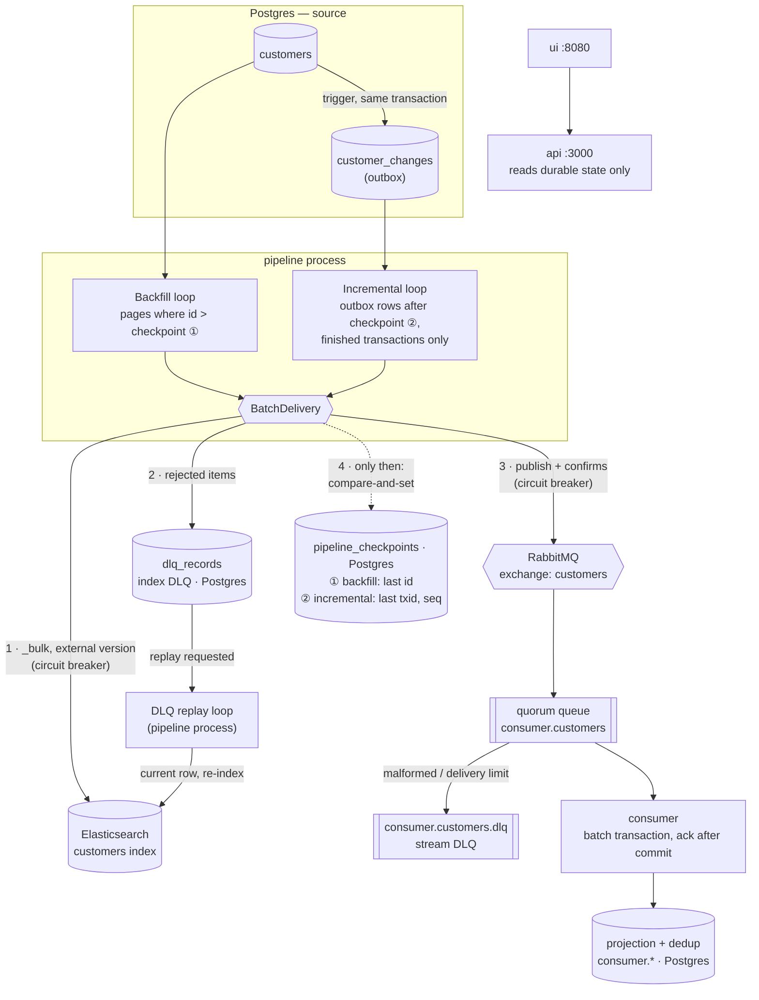
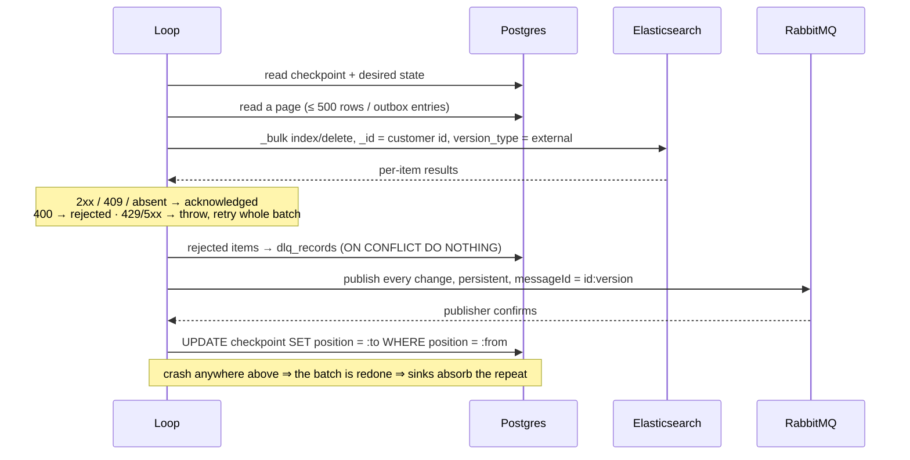

# Kill It Twice — a crash-tolerant replication pipeline

Replicates `customers` from **Postgres** into an **Elasticsearch** index (current state, searchable) and a
**RabbitMQ** event stream (every change, read by an independent consumer). A one-off **backfill** and a
continuous **incremental sync** run at the same time. The point of the project is what happens when things
break — and `./verify.sh` breaks them on purpose and counts.

```
G1 resume after kill ............. PASS (killed at id 308,795 (301,500 docs indexed) / resumed at id 308,795, 0 lost)
G2 no duplicates ................. PASS (1,001,978 source / 1,001,978 index / 1,001,978 consumer / 0 dupes, 44,185 replays absorbed)
G3 sink outage ................... PASS (60s down, 0 lost, resumed in 0.5s, caught up in 18.1s)
G4 partial batch failure ......... PASS (497 written, 3 in DLQ, 3 replayed after fix)
G5 observability ................. PASS (status, metrics and logs answer all five questions; health went down/degraded/ok as the system did)
```

**Documents in this repository**

| File | What it is |
|------|------------|
| [`SPEC.md`](SPEC.md) | The specification the code was built from — committed **before** any code, then changed six times (v1 → v1.6). Each change has a changelog row saying why. |
| [`AGENTS.md`](AGENTS.md) | Instructions for the coding agent: slices, invariants, what not to touch, how to check its own work. |
| [`docs/DEVIATIONS.md`](docs/DEVIATIONS.md) | Every place the implementation departed from the SPEC, written when it happened (D-001 … D-007). |

---

## Contents

1. [Quick start](#1-quick-start)
2. [Architecture](#2-architecture)
3. [Delivery guarantee](#3-delivery-guarantee)
4. [Gates](#4-gates)
5. [Data volume](#5-data-volume)
6. [Architecture decision records](#6-architecture-decision-records)
7. [Capacity notes](#7-capacity-notes)
8. [What I did not build, and why](#8-what-i-did-not-build-and-why)
9. [Where the AI deviated from the spec](#9-where-the-ai-deviated-from-the-spec)
10. [How this was built](#10-how-this-was-built)
11. [Repository map and operations](#11-repository-map-and-operations)

---

## 1. Quick start

**Prerequisites:** Docker with Compose v2 (Docker Desktop is fine) and ~6 GB of memory for Docker.
Nothing else is needed on the host — seed and verify run in containers. Free ports: `3000` (api),
`8080` (UI), `9100` (metrics), `9200` (Elasticsearch), `5433` (Postgres), `5672` / `15672` (RabbitMQ).

```bash
docker compose up -d --build     # the whole system: postgres, elasticsearch, rabbitmq, migrate, pipeline, consumer, api, ui
./seed.sh                        # or: make seed   — 1,000,000 customers (~5 s), resets pipeline state
./verify.sh                      # or: make verify — preflight + G1..G5 (~9 min), exit code 0 only if all pass
```

- One gate: `./verify.sh G3` (or `make verify GATE=G3`); only the preflight: `./verify.sh preflight`.
- **UI:** http://localhost:8080 — Status, Records, Control, Simulation.
- **Status JSON:** http://localhost:3000/api/status · **Prometheus metrics:** http://localhost:9100/metrics
- **RabbitMQ management:** http://localhost:15672 (optio / optio) · **Postgres:** `localhost:5433` (optio / optio)
- On Windows run the `.sh` scripts from Git Bash; `make` is optional (the author's machine has none).

The backfill starts on its own after the seed; the Status tab shows it reach 100 % in ~2–3 minutes.
`verify` resets what it needs itself (checkpoints, index, consumer projection, queue) — you can run it
on any state of the system, repeatedly.

---

## 2. Architecture



Not drawn, to keep the picture readable: `pipeline_control` (desired state, read by every loop step);
`pipeline_heartbeat` (written every 2 s); the api's reads (Postgres and the RabbitMQ management API — never
the pipeline process); and `verify`, which kills and stops `pipeline`, `consumer` and `elasticsearch`
through the Docker socket.

**Where state lives.** Every piece of progress and every control decision is in Postgres:
checkpoints, desired state (pause/resume/settings), DLQ records and replay requests, heartbeat, the
consumer's projection and dedup record. The processes keep nothing in memory that they cannot re-read,
which is why a `docker kill` at any line costs at most one batch.

**One batch** (backfill and incremental alike):



**Processes** — one NestJS codebase, one image, started in roles (`ROLE=`):

| Service | Does | Notes |
|---------|------|-------|
| `migrate` | TypeORM migrations, then exits | the roles wait for it (`service_completed_successfully`) |
| `pipeline` | backfill, incremental, DLQ replay loops; `/metrics`; heartbeat | `mem_limit: 256m`; no auto-restart — verify plays the orchestrator |
| `consumer` | independent stream consumer with its own projection | separate process, separate failure domain |
| `api` | `/api/status`, control, data, simulation | reads only durable state, so it reports a dead pipeline |
| `ui` | Vue 3 console behind nginx (`/api` proxied) | polls every 2 s |
| `seed`, `verify` | one-shot tools (`--profile tools`) | verify drives Docker through the mounted socket |

---

## 3. Delivery guarantee

**Declared guarantee: effectively-once in both sinks; at-least-once on the wire.**

- **The pipeline is at-least-once.** The checkpoint is written only after the index acknowledged (or the
  DLQ durably holds) every record of a batch *and* RabbitMQ confirmed every message. A crash anywhere
  before that write means the batch is read and sent again. A crash can therefore cause repeats, never
  loss. The write itself is compare-and-set, so a concurrent reset is noticed instead of overwritten.
- **Both sinks are idempotent, so the result is effectively-once:**
  - *Index:* `_id` = customer id and `version_type=external` with `version = customers.version`. A repeat is
    a `409` (counted as success); an older version — a backfill page read before an update, a delete that
    already happened — can never overwrite a newer one. Deletes are versioned tombstones.
  - *Consumer:* manual acks after commit; each group of messages is applied in one transaction:
    `INSERT … applied_events (customer_id, version) ON CONFLICT DO NOTHING RETURNING` decides which events
    are new, the projection is updated only `WHERE version < new version`, counters are updated, then one
    `ack`. A redelivery after a crash between commit and ack is recognised and counted as a duplicate.
- **What you do see:** the *stream itself* carries duplicate messages. G2 counts them — e.g.
  `1,093,801 delivered, 44,185 duplicates ignored`. Most of those are not crashes: the backfill and the
  incremental loop legitimately both send a customer that changed while the backfill was running.
- **Not guaranteed:** exactly-once delivery of messages; ordering across customers in the stream (order per
  customer is resolved by `version`, not by arrival); that the stream skips records the index rejected
  (it does not — the sinks are independent, see D-004).

G1 proves "no loss after a crash", G2 proves "no duplicates and no stale versions after many crashes under
concurrent changes", G3 proves the same for a sink outage.

---

## 4. Gates

Run with `./verify.sh`. Each gate sets up its own state, injects the failure, and compares **every**
`(id, version)` it needs to — never a sample.

| Gate | What `verify` does | PASS criteria | Result (last full run) |
|------|--------------------|---------------|------------------------|
| **G1** crash recovery | resets backfill into an empty index, waits for 30 %, `docker kill pipeline`, checks the checkpoint does not move while dead, `docker start` | resumes exactly from the checkpoint (read from its `backfill.started` log line — not 0, not beyond), and every source row ends up in the index | **PASS** — killed at id 308,795 with 301,500 docs indexed (the in-flight batch was in ES but not checkpointed); resumed at 308,795; 0 lost |
| **G2** no duplicates | resets index, projection and queue; backfill + incremental under ~20k concurrent transactions (updates, multi-row updates, inserts, deletes) and one 8 s transaction on an already-backfilled row; kills pipeline at 25 % and 75 %, consumer at 50 % | after convergence: index and consumer projection equal the source for every id — 0 missing, 0 stale, 0 extra (deleted customers gone); count of stream duplicates reported | **PASS** — 1,001,978 / 1,001,978 / 1,001,978; 44,185 replays absorbed |
| **G3** sink outage | after a finished backfill, stops Elasticsearch for 60 s while changes keep coming, then starts it | 0 lost; pipeline CPU ≤ 10 % during the outage; ≤ 40 failed requests; writing resumes ≤ 15 s after the index is healthy | **PASS** — CPU ~0.5 %, 13 failed requests, breaker opened 9×, writing resumed in 0.5–3.7 s, one-minute backlog drained in ~20 s |
| **G4** partial batch | inserts 500 customers in one transaction, 3 with attributes the index mapping rejects | 497 indexed, exactly those 3 `pending` in the DLQ from one batch with reason and position; replay without a fix stays pending (attempts 2); fix + replay (incremental paused, so only the replay can deliver) ⇒ `replayed` and indexed | **PASS** |
| **G5** observability | reads `/metrics` and `/api/status`; then stops the pipeline, stops the index under writes, parks a bad record | all metrics present; status matches Postgres (position, DLQ, consumer counts); health goes `down` (heartbeat), `degraded` (circuit open), `degraded` (DLQ pending) and back to `ok`; batch log lines structured | **PASS** — down in 10 s, degraded in 27 s (breaker needs 5 failures, a stopped container's DNS lookup takes ~4 s each), DLQ degraded in 1 s |

**Honest notes on the gates**

- **G3 did not fail first.** Every other gate was committed failing before its feature existed; G3 already
  passed on the previous commit, because per-loop backoff existed since S2. The circuit breaker added
  afterwards bounds the *worst case* (a loop could sleep up to 30 s after the sink returned) rather than
  improving a failing result — see D-005, including a wrong claim the agent made along the way.
- **The bounds in G3 and G5 are chosen, not given.** "Recovers on its own" and "no busy loop" needed numbers
  to be testable; they were set from measurements with margin, and are documented in the gate files.
- **Timing.** A full `./verify.sh` takes ~9 minutes on a 22-core laptop; G1 and G2 each run a full
  1M-row backfill.
- **What verify does not test:** a RabbitMQ outage as a gate (tested by hand: restart during backfill → 0
  lost, see §8), `docker pause` (hung, not refused, connections), and more than one pipeline instance
  (guarded by compare-and-set, not exercised).

---

## 5. Data volume

**1,000,000 customers** (`SEED_COUNT`, default), generated by `generate_series` inside Postgres in ~5 s.

- **Why not less.** At ~100k rows the backfill finishes in a couple of seconds: `verify` could not reliably
  kill it at 25 / 30 / 50 / 75 %, and holding everything in memory would still work, so the gates would not
  exercise the code paths they exist for.
- **Why not more.** Each full `verify` runs two complete backfills and compares every row in three places;
  1M keeps a full run under ~10 minutes on a laptop with a 2 GB Elasticsearch.
- **"Load everything into memory" is made impossible, not just unlikely.** 1M rows as JS objects are roughly
  1 GB of V8 heap; the pipeline container has `mem_limit: 256m` (heap capped at 192 MB). A "read all rows"
  implementation crashes. Measured use: ~60 MB — one page in memory at a time.
- **Seed bypasses the outbox** (`session_replication_role = replica` on one connection): initial data is the
  backfill's job; otherwise the incremental loop would replay a million inserts.
- The SPEC's first estimate was 2–5k rec/s (3–8 min backfill). Measured ES-only was 12k rec/s, with the
  stream ~7k rec/s. 1M stayed because the kill points still fall well inside a ~2.4-minute backfill.

---

## 6. Architecture decision records

### ADR-1 Change capture: outbox table filled by a trigger
- **Decision.** An `AFTER INSERT/UPDATE/DELETE` trigger writes `(txid, seq, customer_id, op, version)` to
  `customer_changes` in the same transaction as the change; a `BEFORE UPDATE` trigger bumps `version`.
  The outbox holds keys only; the pipeline ships the current row.
- **Alternatives.** Polling `updated_at > cursor` (cannot see deletes, ambiguous ties within one timestamp);
  logical decoding / Debezium (the most faithful, but a separate service and connector configuration).
- **Trade-offs.** Every write pays for one extra insert; the source schema carries the triggers. In return,
  deletes are visible, the version cannot be forgotten by any writer, and lag is exactly measurable.

### ADR-2 Effectively-once: checkpoint after both sinks, compare-and-set
- **Decision.** At-least-once pipeline + idempotent sinks (§3). The checkpoint moves only after every record
  is acknowledged or parked in the DLQ; the move is `UPDATE … WHERE position = :from`.
- **Alternatives.** Checkpoint before writing (at-most-once: loses data on crash); distributed transactions
  across Postgres, Elasticsearch and RabbitMQ (not available for these systems); a blind checkpoint write
  (a reset during a batch would be overwritten and rows skipped — D-001).
- **Trade-offs.** Repeats are normal and must be absorbed downstream — every consumer of the stream has to
  be idempotent. The sinks prove that they are (G2 counts the absorbed repeats).

### ADR-3 Incremental reads only finished transactions, in (txid, seq) order
- **Decision.** Each outbox row records its transaction id; the loop reads
  `txid < pg_snapshot_xmin(pg_current_snapshot())` ordered by `(txid, seq)`, and the checkpoint is that pair.
- **Alternatives.** `seq > checkpoint` (loses a transaction that took its seq early and committed late);
  SPEC v1's "skip a gap after 5 s" (loses any transaction open longer than 5 s — reproduced by hand, D-003).
- **Trade-offs.** A long-running transaction anywhere in the database holds the loop back: lag grows until
  it finishes. It never loses data. G2 contains an 8-second transaction to prove it.

### ADR-4 RabbitMQ (quorum queue, confirms, dead-lettering) for the stream
- **Decision.** Topic exchange `customers`, persistent messages with `messageId = id:version`, publisher
  confirms before checkpointing; a quorum queue with a delivery limit and a dead-letter exchange.
- **Alternatives.** Kafka (offset replay, partition ordering; heavier to run, dead-lettering is hand-made,
  and not the team's stack).
- **Trade-offs.** No replay from an offset: a new consumer cannot re-read history (it would be seeded by a
  backfill instead). Measured to be the throughput bottleneck (§7). Both publisher and consumer declare the
  topology, so nothing is unroutable before the consumer's first start — at the cost of the publisher
  knowing the consumer's queue.

### ADR-5 TypeORM, with hot-path rules
- **Decision.** TypeORM for connection, entities, migrations and DI; in the pipeline and the consumer no
  `save()` and no read-then-write — compare-and-write is one SQL statement; hot loops read raw rows.
- **Alternatives.** Raw `pg` (loses the Nest-idiomatic structure and migrations the team expects); plain
  TypeORM (`save()` in the consumer would reintroduce the dedup race).
- **Trade-offs.** Two styles in one codebase, kept apart by a rule that is easy to check. (The agent first
  argued against TypeORM with that race; the race belongs to `save()`, not TypeORM — see §9.)

### ADR-6 Postgres for control, DLQ, replay requests, heartbeat and consumer dedup — no Redis
- **Decision.** Every piece of desired state and bookkeeping lives in Postgres, including the consumer's dedup
  record (separate schema).
- **Alternatives.** Redis for dedup and control flags (fast, but a second store, and dedup + projection
  update could not commit atomically).
- **Trade-offs.** More load on the source database; `applied_events` grows without retention. In return:
  a pause or a replay request survives a crash, and the consumer's "seen" record and its effect commit together.

### ADR-7 A circuit breaker per sink, and a short backoff
- **Decision.** One breaker per sink shared by all loops (5 failures ⇒ open 5 s ⇒ one probe); per-loop
  exponential backoff with jitter capped at 5 s.
- **Alternatives.** Backoff only, 30 s cap (SPEC v1) — worked, but after a sink returned a loop could sleep
  up to 30 s, and every loop probed the sink on its own.
- **Trade-offs.** The sink sees one request per 5 s while it is down, and writing resumes within about one
  probe interval (measured 0.5–3.7 s). A breaker that opens on 5 failures also opens on a short blip.

### ADR-8 One codebase, several processes; status from durable state only
- **Decision.** One image, roles via `ROLE`; the api reads Postgres and the RabbitMQ management API only —
  never the pipeline process. The pipeline writes a heartbeat with its rates and breaker states.
- **Alternatives.** Separate apps (more boilerplate); api embedded in the pipeline (killing the pipeline would
  take the status with it); api scraping the pipeline's `/metrics` (status depends on the process whose
  death it must report — D-006).
- **Trade-offs.** Throughput and breaker state are up to 2 s old; while the pipeline is dead, breaker states
  are reported as `unknown`.

---

## 7. Capacity notes

Measured on one laptop (Docker Desktop, 22 cores, 16 GB), 1M customers, batch 500 unless stated.

| What | Measured |
|------|----------|
| Seed, 1M rows (`generate_series`) | ~5 s |
| Backfill, index only (S2, before the stream existed) | ~12,000 rec/s — 1M in ~85 s; ~25–35 ms per batch |
| Backfill, index + stream, fresh index | ~7,000 rec/s — 1M in ~2.4 min; ~60–70 ms per batch |
| Backfill re-run over a full index (all `409`), batch 500 → 2000 | 5,300 → 6,200 rec/s (+17 %) |
| Consumer | keeps pace with the pipeline (queue stays near empty); batches of ≤ 500 per transaction |
| Pipeline memory | ~60 MB of the 256 MB limit |
| Sink outage (60 s) | resume 0.5–3.7 s after the index is back, backlog of ~47k changes drained in ~20 s |
| Full `./verify.sh` | ~9 min |

**Where the bottleneck is.** During backfill RabbitMQ runs at **80–106 % CPU (one core)**, Elasticsearch at
7–11 %, the pipeline at 40–50 %, Postgres at 16–25 %. Adding the stream sink halved throughput
(12k → 7k rec/s), and a 4× larger batch bought only 17 %. The cost is per message in the broker: one
persistent message per change into a replicated quorum-queue log, confirmed, then delivered and acked by
the consumer. Second: each loop has one batch in flight — read, index, publish, confirm, checkpoint are
sequential.

**To double throughput, in order of expected effect:**
1. **Fewer, larger messages.** Publish one message per batch (e.g. 100–500 changes) instead of one per change.
   The broker's cost is per message, so this attacks the bottleneck directly. The consumer already applies in
   batches; dedup stays per `(id, version)` inside the message.
2. **Index and stream in parallel within a batch.** Both must be done before the checkpoint, but not one after
   the other — `Promise.all` on the two sinks cuts the per-batch latency to the slower of the two.
3. **Parallel backfill.** Split the id range into N ranges with one checkpoint each; the sinks are idempotent
   and version-guarded, so ranges do not need to coordinate.
4. **Spread the stream.** Several queues behind a consistent-hash exchange (by customer id) use more broker
   cores, and keep per-customer order.
5. During a backfill only: `refresh_interval: -1` on the index and larger bulk requests.

---

## 8. What I did not build, and why

| Not built | Why |
|-----------|-----|
| CDC from the WAL (Debezium / logical decoding) | A service and connector to run and configure; the trigger + outbox (ADR-1) gives the same observable guarantees here, including deletes. |
| Kafka and replay from an offset | ADR-4. A new consumer would be bootstrapped by a backfill instead of re-reading history. |
| Horizontal scaling / parallel backfill workers | Not needed for 1M rows; designed for in §7 (per-range checkpoints). Two pipeline instances are *guarded* (compare-and-set) but not a supported mode. |
| Exactly-once delivery | Not achievable across Postgres → Elasticsearch / RabbitMQ without distributed transactions; effectively-once is declared instead (§3). |
| RabbitMQ outage as a gate | Only the index outage (G3) is automated. A broker restart mid-backfill was tested by hand: pipeline and consumer reconnect with backoff, 1M/1M, 0 lost. |
| `docker pause` faults (hung connections) | G3 stops the container (refused connections). Timeouts are configured (`ES_REQUEST_TIMEOUT_MS`, confirm timeout) but not exercised by a gate. |
| Auto-resolving stale DLQ records | If a later version of a rejected customer is indexed successfully, its old DLQ record stays `pending` until someone replays it (the replay then succeeds at once). |
| Retention for `customer_changes` and `consumer.applied_events` | Both grow without bound; production would prune rows behind the checkpoint and dedup rows older than the redelivery window. |
| Auth on the api / UI; a safe simulation | The simulation stops containers through the Docker socket mounted into the api — dev only, stated in the code and UI. |
| Prometheus / Grafana containers | The pipeline exposes `/metrics` in Prometheus format; wiring a scraper and dashboards added nothing to the gates. |
| Push updates in the UI (SSE / WebSocket) | Polling every 2 s is enough for an operator console and survives restarts without reconnect logic. |
| A component library / design system for the UI | The UI is an operator tool; the time went to gates and documentation. |
| A linter | Strict TypeScript and unit tests for the pure logic are the checks (AGENTS.md). |

---

## 9. Where the AI deviated from the spec

The code was written by an AI agent (Claude) working from `SPEC.md` and `AGENTS.md`, in slices: brief →
failing gate → implementation → walkthrough → the human breaks it by hand → commit only after the human's ok.
These are the cases where the agent's output was wrong or the spec it was given was not enough. The full log
is [`docs/DEVIATIONS.md`](docs/DEVIATIONS.md).

**1. A misleading argument against TypeORM (agent error → SPEC v1.1).**
*Task:* choose the data-access layer. *What happened:* the agent recommended raw `pg`, arguing that TypeORM
causes a race in the consumer's dedup (`findOne` then `save`). The human pushed back that a Nest project
without TypeORM felt wrong. *Why it was wrong:* the race belongs to `repository.save()`, not to TypeORM —
QueryBuilder expresses the same single atomic `UPDATE … WHERE version < :v`. *Fix:* TypeORM with explicit
hot-path rules (ADR-5), recorded as SPEC v1.1 with the reason. Lesson: the agent's first argument was
right about the risk and wrong about its cause.

**2. The spec's outbox rule would have lost data (spec insufficient → D-003, SPEC v1.3).**
*Task:* SPEC v1 §5.4 told the agent to "consume up to the first seq gap; after 5 s treat it as a rollback
and skip it". *Why insufficient:* a gap is also a transaction that took its seq early and has not committed
yet; any transaction open longer than 5 s would be skipped for good. *Steps:* the agent stopped before
implementing, reproduced it with two sessions (`seq 180724` visible while `180723` was still open), the human
chose the xmin-based reader over keeping v1, and G2 got an 8-second transaction so the gate would catch a
regression.

**3. A test that could not fail (agent error in the gate itself).**
*Task:* make G2 prove the incremental loop does not lose a slow transaction's change. *What happened:* the
agent's first version picked a random customer for the slow transaction — often one the backfill had not
reached yet. The backfill would then copy the change itself, so the gate would pass even with a reader that
lost it. It passed, and the agent noticed only when analysing the passing run. *Fix:* the customer is chosen
from the already-backfilled range, so only the incremental loop can deliver the change. Lesson: a gate that
passes is not evidence until you know it could fail.

**4. An unreproducible number used to justify a feature (agent error → D-005).**
*Task:* G3 and the circuit breaker. *What happened:* the agent reported "recovery took 89 s with backoff
alone" and presented the breaker as the fix. Re-measuring did not reproduce it (3.8 s and 8.5 s), and part
of the 89 s was verify's own wait for three quiet polls counted as recovery time. *Fix:* the claim was
withdrawn before committing, the measurement was corrected (convergence = start of the quiet streak;
"resumed" = first successful write), and the breaker is documented for what it does — bound the worst case.

**5. Per-message transactions in the consumer (spec incomplete → D-002).**
*Task:* SPEC §6.3 described the consumer's atomic dedup as if per message. *Why insufficient:* 1M commits at
~1 ms is 15–30 minutes of G2. *Fix:* the agent flagged it before implementing; the consumer applies groups of
≤ 500 in one transaction and acks once, with the same guarantee (nothing acked before commit).

Smaller ones, all in the log: a flag in the first backfill loop that would never have logged the resume point
if the first step failed (caught in the agent's own review before commit); a reset racing a running pipeline
(D-001); how DLQ replay is triggered (D-004); status built from durable state only (D-006).

---

## 10. How this was built

- **SPEC first.** `SPEC.md` v1 was the first commit, before any code; it changed six times, each with a
  changelog row and a reason (`git log --follow SPEC.md`).
- **Gate first.** Each slice added its gate to `verify/` and committed it failing, then the feature
  (`test(verify): … (failing)` followed by `feat(…)`), except G3 (see §4).

| Date | Commit | |
|------|--------|--|
| 09-24 | `docs: add SPEC.md v1` → `v1.1` → `AGENTS.md` | spec and agent instructions, no code |
| 09-26 | S1 | compose, schema + triggers, seed, verify runner with preflight |
| 09-28 | S2 · S3 · SPEC v1.2 | backfill + checkpoints (G1); RabbitMQ + consumer (G2); compare-and-set |
| 09-29 | S4 · S5 · SPEC v1.3–1.4 | incremental from the outbox (xmin); DLQ + replay (G4) |
| 09-30 | S6 · S7 · S8 · SPEC v1.5–1.6 | circuit breaker (G3); metrics, heartbeat, status (G5); api + UI |

---

## 11. Repository map and operations

```
apps/server/            NestJS; ROLE = migrate | seed | pipeline | consumer | api
  src/roles/pipeline/   backfill, incremental and DLQ replay loops, sinks, breakers, metrics, heartbeat
  src/roles/consumer/   RabbitMQ consumer, projection + dedup
  src/roles/api/        status, control, data, simulation
  src/database/         TypeORM entities and migrations (schema, triggers)
  src/shared/           config, logger, backoff, circuit breaker, RabbitMQ topology and event contract
apps/ui/                Vue 3 + Vite, served by nginx
verify/                 gate runner (preflight, G1–G5)
docker-compose.yml  seed.sh  verify.sh  Makefile
SPEC.md  AGENTS.md  docs/DEVIATIONS.md
```

**Useful commands**

```bash
docker compose logs -f pipeline                       # one JSON line per batch and per state change
curl -s localhost:3000/api/status                     # where is it, is it healthy, and why not
curl -s localhost:9100/metrics | grep ^pipeline_      # Prometheus metrics
npm run typecheck && npm test -w apps/server          # on the host, if Node 20 is installed (optional)
```

**Configuration** — everything through environment variables with defaults in
[`apps/server/src/shared/config.ts`](apps/server/src/shared/config.ts): `SEED_COUNT`, batch size and poll
interval (also live, from the UI), `RETRY_BASE_MS` / `RETRY_MAX_MS`, `BREAKER_THRESHOLD` /
`BREAKER_OPEN_MS`, `DELIVERY_LIMIT`, `CONSUMER_BATCH_SIZE`, `HEALTH_DOWN_AFTER_MS`,
`HEALTH_MAX_LAG_SECONDS`, ports.

**Health rules** (`/api/status`): `down` — pipeline heartbeat older than 10 s; `degraded` — a sink's circuit
is open or half-open, incremental lag over 30 s, or DLQ records pending; otherwise `ok`. Every non-ok status
lists its reasons.

**Troubleshooting**
- *Elasticsearch exits at start:* give Docker more memory (ES runs with a 1 GB heap in a 2 GB limit).
- *Port already in use:* change the left side of the port mapping in `docker-compose.yml`.
- *`./verify.sh` says preflight failed:* it prints which step; usually the system is still starting or not
  seeded — run `./seed.sh`.
- *Scripts fail with `\r` errors on Windows:* the repo enforces LF (`.gitattributes`); re-clone if your Git
  converted line endings before that file existed.
