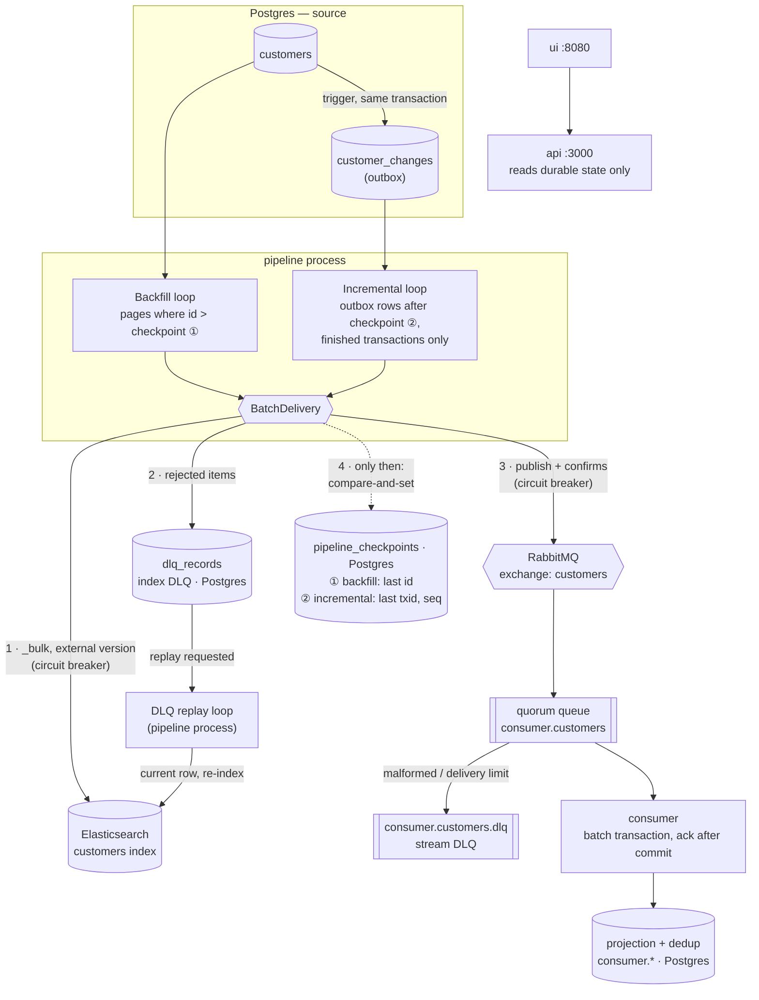

# SPEC — Kill It Twice: a crash-tolerant replication pipeline

## 0. Status & Changelog

| Version | Date       | Summary |
|---------|------------|---------|
| v1      | 2026-09-24 | Initial spec, written before any code. Decisions marked **(tentative)** and everything in §14 are expected to change once measured. |
| v1.1    | 2026-09-24 | **Data access: TypeORM with hot-path rules (§5.6)** instead of the implied raw `pg`. Why: the first argument against an ORM (race in consumer dedup) was really about `repository.save()`, not TypeORM — QueryBuilder expresses the same atomic SQL. TypeORM gives the Nest-idiomatic structure (entities, migrations, DI) the team expects; the rules keep the critical SQL explicit. Added one-shot `migrate` service (§5.1) and single-gate verify runs (§11). |
| v1.2    | 2026-09-28 | **Checkpoint writes are compare-and-set; seed stops the pipeline (§4.8, §6.2).** Why: v1 assumed the pipeline is the only writer of checkpoints — a reset during a batch would be overwritten and rows skipped (D-001). Also recorded: measured ES-only backfill ≈ 12k rec/s (1M in ~85 s), faster than the 2–5k estimate; volume stays 1M until the stream sink is added and re-measured. |
| v1.3    | 2026-09-28 | **Incremental reads only finished transactions, in (txid, seq) order (§4.2, §4.3, §5.4).** Why: the v1 "skip a gap after 5 s" rule loses the change of any transaction open longer than 5 s (D-003, reproduced by hand; G2 now contains such a transaction). Also: consumer applies events in batches of ≤ 500 per transaction (§6.3, D-002); versioned deletes and `gc_deletes` (§5.5); G2 procedure (§11). Measured with the stream sink: backfill ≈ 7k rec/s (1M in ~2.4 min) — 1M stays. |
| v1.4    | 2026-09-29 | **DLQ replay is requested in Postgres and performed by a pipeline loop; it targets only the rejecting sink (§4.4, §7.4). Batch order ES → DLQ → stream (§6.2).** Why: v1 did not say who performs a replay, how a request survives a crash, or what "the same sink path" means (D-004). |
| v1.5    | 2026-09-29 | **Breaker open interval 5 s (was 15 s), backoff cap 5 s (was 30 s); concrete G3 bounds (§7.2, §11).** Why: the breaker's single probe protects a down sink, so long per-loop sleeps only delay recovery (D-005). Measured: writing resumes 0.6–3.7 s after the index is back; a one-minute backlog drains in ~20 s. |
| v1.6    | 2026-09-30 | **`/api/status` reads only durable state; heartbeat carries breaker states (§4.7, §8.2).** Why: a status that asks the pipeline depends on the process whose death it must report (D-006). |
| v1.7    | 2026-09-30 | **As built — the spec synced with the code before submission.** A pre-submission review found sections that had drifted without a changelog row: the §5.2 diagram still showed the pre-v1.3 `seq > checkpoint` reader; §8.1 listed two metrics that do not exist (`pipeline_outbox_gaps_skipped_total`, obsolete since D-003; `pipeline_sink_up`, never built) and defined lag and result labels differently from the code; §9/§10 named endpoints that were built differently (D-007); §4.5 named an ES 7 exception; §4.8 was still "tentative". Changed: those sections now describe what runs; G3 stops the index in the middle of a backfill (§11 — the assignment says "in the middle of the work"); every §14 question is closed with its answer; §2.1 records what was and was not built. Nothing in the design changed in this version. |
| v1.8    | 2026-09-30 | **§5.1: one Dockerfile, not one shared image tag.** Why: the clean-clone test (fresh clone, no build cache) failed — five services building one tag in parallel race to export it (D-009). |

Rule for later versions: every change to this file gets a changelog row that says **what changed and why**
(measurement, failed approach, agent deviation). Deviations of the implementation from this spec are
logged in `docs/DEVIATIONS.md` as they happen and summarised in the README.

## 1. Goal

Replicate `customers` from a relational source (Postgres) into two sinks:

1. **Search index** (Elasticsearch) — current state of every customer, searchable.
2. **Event stream** (RabbitMQ) — a stream of changes, consumed by at least one independent consumer.

Two modes run **at the same time** against the same source: a one-off **backfill** of all existing rows and a
continuous **incremental sync** of changes. The system must survive process crashes, sink outages and bad
records without losing or duplicating data, and must prove it with a single command: `make verify`.

**Non-goals:** multi-tenant sources, arbitrary schemas, horizontal scaling, auth, production-grade UI.

## 2. Scope

### 2.1 Priorities

| Priority | Items |
|----------|-------|
| **P0** | G1 crash recovery, G2 no duplicates, G4 partial batch → DLQ, `make verify` for these, `docker compose up`, `make seed` |
| **P1** | G3 sink outage (backoff + circuit breaker), G5 metrics/status/health, UI: status + control + DLQ replay + simulation |
| **P2** | UI push updates (SSE/WebSocket), broker (RabbitMQ) outage gate, UI polish, parallel backfill workers |

If time runs out, P2 goes first, then UI features — never the quality of an already-started gate.
Three solid gates beat five half-working ones.

**Outcome (v1.7):** all of P0 and P1 were built; none of P2 (README §8 explains each). A RabbitMQ restart
was tested by hand instead of as a gate.

### 2.2 Out of scope (and why)

- **CDC via WAL (Debezium)** — most correct in production, but an extra service and configuration surface
  that doesn't fit the time budget. Outbox + trigger gives the same observable guarantees here (see §13).
- **Kafka** — see ADR in §13; replay-from-offset is the main thing we give up.
- **Schema evolution / multiple source tables** — one table is enough to exercise every gate.
- **Exactly-once across sinks** — not achievable across Postgres → ES/RabbitMQ without distributed
  transactions; we declare *effectively-once* instead (§6).

## 3. Constraints

- Stack: **NestJS** (TypeScript) + **TypeORM** (rules in §5.6), **Vue 3 + Vite**, **Postgres**, **Elasticsearch**,
  **RabbitMQ**, Docker Compose.
- Time: ~7 calendar days left at the time of writing (deadline 2026-10-01 12:13).
- Runs on a single laptop. **Only Docker is required on the host** (no local `make`, Node or psql needed —
  the author's own machine has no `make`).
- `docker compose up` brings up the whole system; `make seed` and `make verify` (or `./seed.sh`,
  `./verify.sh`) are the only other commands.

## 4. Data model

### 4.1 Source: `customers`

| Column       | Type          | Notes |
|--------------|---------------|-------|
| `id`         | `BIGINT` PK   | dense, generated by seed |
| `email`      | `TEXT`        | |
| `name`       | `TEXT`        | |
| `city`       | `TEXT`        | used for segmentation queries |
| `segment`    | `TEXT`        | e.g. `retail`, `vip`, `churn-risk` |
| `balance`    | `NUMERIC(12,2)` | |
| `attributes` | `JSONB`       | free-form client data; **the lever for G4** (see 4.5) |
| `version`    | `BIGINT`      | +1 on every update, set by trigger |
| `updated_at` | `TIMESTAMPTZ` | set by trigger |

A `BEFORE UPDATE` trigger sets `version = OLD.version + 1` and `updated_at = now()`, so no writer can forget it.

### 4.2 Outbox: `customer_changes`

Filled by an `AFTER INSERT/UPDATE/DELETE` trigger on `customers`, in the same transaction as the change.

| Column       | Type           | Notes |
|--------------|----------------|-------|
| `seq`        | `BIGSERIAL` PK | allocation order (not commit order — see §5.4) |
| `txid`       | `BIGINT`       | writing transaction, `pg_current_xact_id()` default (v1.3) |
| `customer_id`| `BIGINT`       | |
| `op`         | `TEXT`         | `upsert` \| `delete` |
| `version`    | `BIGINT`       | for deletes: `OLD.version + 1`, so a delete always beats the last upsert |
| `created_at` | `TIMESTAMPTZ`  | used for lag in seconds |

The outbox stores **keys, not payloads**: the pipeline reads the current row at processing time.
This keeps the outbox small and means a burst of 10 updates to one row doesn't need 10 payloads.

### 4.3 `pipeline_checkpoints`

| `stream` (PK)  | `position_txid` | `position` | `completed_at`, `updated_at` |
|----------------|-----------------|------------|--------------|
| `backfill`     | 0 | last fully-handled `customers.id` | |
| `incremental`  | last fully-handled outbox `txid` | … and its `seq` | |

### 4.4 `dlq_records`

`id, sink ('es' | 'stream'), customer_id, version, payload JSONB, error_type, error_reason,
stream ('backfill' | 'incremental'), batch_id, batch_position, attempts, status ('pending' | 'replayed' | 'failed'),
created_at, last_attempt_at, replay_requested_at` (v1.4). `failed` is allowed by the schema but never set:
a record that keeps failing stays `pending` with a growing `attempts` count (v1.7).
Enough context to understand the failure without logs and to replay it (§7.4). Only the index produces
rows (`sink = 'es'`): the broker does not reject individual accepted messages, and the consumer's poison
messages go to the RabbitMQ dead-letter queue (§7.3).

### 4.5 How a record can be "bad"

Postgres column types are strict, so the rejection has to come from the sink. ES mapping for `attributes` is
`dynamic: strict` with typed fields (e.g. `attributes.age: integer`, `attributes.signup_channel: keyword`).
A row with `attributes = {"age": "not-a-number"}` is valid in Postgres and rejected by ES 8 with
`document_parsing_exception`; an unknown attribute (`{"favourite_colour": …}`) with
`strict_dynamic_mapping_exception` — realistic "client sent garbage" cases. (v1 named the ES 7
`mapper_parsing_exception`; corrected in v1.7.)

### 4.6 `pipeline_control`

Single row, the **desired** state, written by the API, read by the pipeline every loop:
`backfill_state ('running' | 'paused')`, `incremental_state`, `batch_size` (default 500),
`poll_interval_ms` (default 1000), `updated_at`.
Stored in Postgres (not in pipeline memory) so a paused pipeline stays paused after a crash.

### 4.7 `pipeline_heartbeat`

Pipeline writes `(instance_id, started_at, last_beat_at, backfill_rate, incremental_rate, details)` every
2 s; `details` holds each sink's breaker state (v1.6). Lets the API report "pipeline is dead" and last
known throughput and breaker states even while the pipeline is down.

### 4.8 Data volume: 1,000,000 customers

- **Why not less:** at ~100k the backfill finishes in seconds — `verify` cannot reliably kill it mid-run,
  and "load everything into memory" still works.
- **Why not more:** ES on a laptop is the limit; every verify run re-checks the full dataset. The target is a
  full `make verify` in ≤ 20 min.
- **Making "load it all into memory" impossible on purpose:** 1M rows as JS objects is roughly ~1 GB of V8
  heap. The pipeline container gets `mem_limit: 256m`, so any accidental "read all rows" implementation
  crashes instead of silently working.
- Expected backfill throughput 2–5k rec/s → 3–8 min backfill. **Measured** (v1.2, v1.3): ~12k rec/s
  index-only, ~7k rec/s with the stream sink — 1M in ~2.4 min. The number stayed at 1M: the kill points of
  G1–G3 still fall well inside the backfill, and a full `verify` takes ~13 min (v1.7).
- Seed uses `generate_series` in SQL (seconds, not minutes) and **bypasses the outbox trigger**
  (`session_replication_role = replica`): initial data is the backfill's job, not the incremental's.
- Seed resets checkpoints, deletes the index, truncates the consumer's projection and dedup record and
  purges its queue (all of them hold versions of the old data), so `seed.sh` **stops the pipeline and the
  consumer first** and starts them afterwards (D-001). Elasticsearch runs with `action.auto_create_index=false`: a write into a deleted index fails
  instead of recreating it without the strict mapping; only the pipeline creates the index.

## 5. Architecture

### 5.1 Components

One NestJS codebase (`apps/server`) and one Dockerfile (each service builds it; the images share every
layer — a single shared image tag raced in cold builds, D-009), started in three long-running roles via `ROLE`
(plus the one-shot `migrate` and `seed`):

| Service    | Role | Why separate |
|------------|------|--------------|
| `pipeline` | backfill, incremental and DLQ-replay loops; `/metrics` on :9100; heartbeat every 2 s | the thing `verify` kills; must not take the API down with it. No auto-restart: `verify` plays the orchestrator |
| `consumer` | independent RabbitMQ consumer with its own projection | assignment requires an independent consumer |
| `api`      | :3000 — status, control, data, simulation (§9) | stays up while pipeline is killed, so recovery is observable |
| `migrate`  | one-shot: runs TypeORM migrations, then exits | the roles start in parallel; only one process may migrate. Others `depends_on: service_completed_successfully` |
| `ui`       | Vue 3 SPA served by nginx on :8080, which proxies `/api` to the api | one origin, no CORS (D-007) |
| `seed`, `verify` | one-shot tools (`--profile tools`); verify drives Docker through the mounted socket | |
| `postgres`, `elasticsearch`, `rabbitmq` | infrastructure | |

### 5.2 Diagram

v1.7: redrawn as built (v1's diagram still showed the pre-v1.3 `seq > checkpoint` reader and an api
reading the pipeline). The same diagram is in the README.



Not drawn: `pipeline_control` (read by every loop step), `pipeline_heartbeat` (written every 2 s), the
api's reads (Postgres and the RabbitMQ management API only), and `verify`.

### 5.3 Backfill path

1. Read `position` for `backfill`.
2. `SELECT … FROM customers WHERE id > $position ORDER BY id LIMIT $batch_size` (keyset pagination — no
   `OFFSET`, constant cost per page, never loads the table).
3. Write the batch to both sinks (§6.2).
4. Advance checkpoint to the last id of the batch.
5. When a page comes back empty, backfill is `completed` (stored, visible in UI). Reset = set position to 0.

### 5.4 Incremental path

1. Read the `(position_txid, position)` checkpoint for `incremental`.
2. `SELECT … FROM customer_changes WHERE (txid, seq) > (:txid, :seq)
   AND txid < pg_snapshot_xmin(pg_current_snapshot()) ORDER BY txid, seq LIMIT :batch_size`.
3. One change per customer: its **current** row ⇒ upsert; row missing and the page holds its delete entry ⇒
   delete with that entry's version; row missing without a delete entry in this page ⇒ skip (a later page
   carries the delete).
4. Write to both sinks, advance the checkpoint (compare-and-set) to the last `(txid, seq)` read.
5. If the page was not full: sleep `poll_interval_ms`.

**Commit-order gaps (v1.3, D-003).** `seq` is assigned at insert, but transactions commit in a different
order: `seq=101` can be visible while `seq=100` is still uncommitted, and a checkpoint past 101 would lose
100 for good. v1 proposed "skip a gap after 5 s", which loses the change of any transaction open longer
than that. Instead the loop reads only rows of **finished** transactions (`txid` below the snapshot's
`xmin`, the oldest running transaction) in `(txid, seq)` order — a set that can never grow behind the
position. Cost: a long-running transaction anywhere in the database holds the loop back (lag grows);
it never loses data.

### 5.5 Backfill and incremental at the same time

Both loops can write the same customer. Race: incremental writes v5, then backfill (which read the row
earlier) writes v4 over it. Prevented by the sinks, not by locking:

- **ES:** `version_type=external` with `version = customers.version`. ES rejects a write whose version is
  not greater than the stored one. A `409 version_conflict` is treated as **success** (a newer or identical
  version is already there). Deletes are versioned too and leave a tombstone; `index.gc_deletes` is 1 h
  (default 60 s) so a late, older upsert is still rejected after a long retry. A delete of a document the
  index never had (`404 not_found`) counts as success.
- **Consumer:** applies an event only if `version` > the version in its projection (§6.3).

### 5.6 Data access rules (TypeORM)

TypeORM provides the connection, entities (schema as code), migrations and repository injection.
It is **not** allowed to hide the SQL that the guarantees depend on:

1. **No read-then-write in `pipeline` and `consumer`.** `repository.save()`, or `find*()` followed by a
   write, is forbidden there. Compare-and-write must be a single SQL statement via QueryBuilder or
   `query()` (e.g. `UPDATE … WHERE id = :id AND version < :v`, `INSERT … ON CONFLICT DO NOTHING`).
2. **Hot loops use raw results.** Backfill/incremental reads use `getRawMany()` / `query()`, never
   `getMany()` — no entity hydration for 1M rows under a 256 MB limit.
3. **Schema changes only through migrations.** `synchronize: false` everywhere. Triggers and functions live
   in migrations as raw SQL. An applied migration is never edited; a new one is added.
4. **Always bound parameters** (`:name` / `$1`), never string concatenation into SQL.

In `api` (DLQ list, settings, checkpoints, status) ordinary repository usage is fine.

## 6. Delivery guarantee

### 6.1 Declared guarantee: **effectively-once**

The pipeline is **at-least-once** (a batch may be written again after a crash); both sinks are
**idempotent**, so a repeated write changes nothing. Result: every customer appears once, at its latest
version, in the index and in the consumer's projection. The *stream itself* may carry duplicate messages —
that is stated openly, and the consumer counts them.

### 6.2 Order of operations per batch (the core invariant)

```
read batch → ES _bulk → classify items → write DLQ rows → RabbitMQ publish + wait for confirms → advance checkpoint
```

**The checkpoint moves only when every record of the batch is either acknowledged by each sink or durably
stored in `dlq_records` for that sink.** Crash anywhere before the checkpoint write ⇒ the batch is replayed
⇒ duplicates are absorbed by idempotency. Crash can never cause loss.

The checkpoint write is **compare-and-set**: `UPDATE … SET position = :to WHERE position = :from`. If
anything else moved the checkpoint during the batch (a reset, a second pipeline instance), the update
touches no row, the batch is dropped and the loop re-reads the checkpoint. A blind write would restore
the old position and skip rows.

### 6.3 Idempotency per sink

- **ES:** `_id = customer id`, external version. Replays are no-ops (409 → success).
- **RabbitMQ:** message carries `customer_id`, `version`, `op`, `source` (`backfill`|`incremental`), `data`
  (the current row for upserts, `null` for deletes) and `emitted_at`; `message_id = "{id}:{version}"`; routing
  key `customer.upserted` / `customer.deleted`. Durable exchange, persistent messages, publisher confirms.
- **Consumer:** manual ack; messages are grouped (≤ 500 or 50 ms, D-002) and each group is applied in
  **one Postgres transaction**: insert into `consumer.applied_events(customer_id, version)` with
  `ON CONFLICT DO NOTHING RETURNING` (PK ⇒ duplicate detected), upsert `consumer.customers(id, version,
  deleted, …)` only where the version is newer, add to `consumer.stats(applied, duplicates)`; then one
  `ack(last, multiple)`. Nothing is acked before its transaction commits.
  Store is Postgres (schema `consumer`), not Redis, because dedup and side effect must commit atomically.

## 7. Failure handling

### 7.1 Process crash (G1)
Nothing to do at runtime — correctness comes from §6.2. On start the pipeline reads its checkpoints and
continues. The last partially-written batch is re-sent (≤ `batch_size` records re-written, 0 lost).

### 7.2 Sink outage (G3)
- Every loop retries with **exponential backoff with jitter**: 0.5 s → 1 → 2 → 4 → capped at 5 s (v1.5).
- **Circuit breaker per sink**, shared by all loops: 5 consecutive failures ⇒ open for 5 s (v1.5), then one
  probe; success ⇒ closed, failure ⇒ open again. While open, calls fail fast without touching the sink and
  loops sleep until the next probe. The short cap is deliberate (D-005): the breaker, not long per-loop
  sleeps, protects a down sink, and long sleeps only delay recovery.
- While a sink is down the affected loop **waits** (no busy loop, checkpoint does not move, nothing is read
  ahead). Breaker state is exported as a metric and shown in health.
- Classification of ES bulk item errors: `409` → success; `404 not_found` on a delete → success (already
  absent); `429`, `5xx`, timeouts → retry the whole batch; `index_not_found` → recreate the index, retry;
  any other `400` (in ES 8: `document_parsing_exception`, `strict_dynamic_mapping_exception`) → permanent → DLQ.

### 7.3 Partial batch failure (G4)
ES `_bulk` returns one result per item. Permanent failures (e.g. 3 of 500) go to `dlq_records` with full
context; the other 497 count as written; the batch is **not** rolled back or retried as a whole.
Stream sink: messages are published for all records the source produced; the consumer side has its own
poison-message path — quorum queue with `x-delivery-limit` ⇒ dead-letter exchange ⇒ `consumer.customers.dlq`.
A message the consumer cannot parse is dead-lettered at once (`nack`, no requeue); the delivery limit catches
messages that crash the consumer repeatedly.

### 7.4 DLQ replay
A replay is **requested** by setting `dlq_records.replay_requested_at` (api, UI, verify) and **carried out**
by the pipeline's DLQ replay loop — the same desired-state-in-Postgres pattern as `pipeline_control`, so a
request survives a crash (v1.4, D-004). The loop **re-reads the current source row** by `customer_id` — the
usual fix is in the source data — and writes it to the sink that rejected it (the index only; a source fix
reaches the stream through the incremental loop). Success ⇒ `replayed`; rejected again ⇒ `attempts++`,
stays `pending`, latest reason kept. Consumer DLQ messages can be shovelled back to the main queue from the UI.

## 8. Observability (G5)

### 8.1 Metrics (`GET /metrics` on pipeline :9100, Prometheus text format)

As built (v1.7). Counters are per process and restart at 0; the durable answers (positions, lag, DLQ) are
gauges refreshed by the heartbeat from Postgres. Every known label set is exported from start-up with 0.

| Metric | Type | Meaning |
|--------|------|---------|
| `pipeline_records_total{stream,sink,result}` | counter | `sink="es"`: `written` \| `absent` (delete of a missing doc) \| `conflict` (409) \| `dlq`; `sink="stream"`: `published` |
| `pipeline_batch_duration_seconds{stream}` | histogram | read + both sinks + checkpoint, per batch |
| `pipeline_checkpoint_position{stream}` | gauge | backfill: last customer id; incremental: last outbox seq |
| `pipeline_backfill_total_rows` | gauge | current `max(customers.id)` — where the backfill ends |
| `pipeline_throughput_records_per_second{stream}` | gauge | records per second over the last 10 s |
| `pipeline_incremental_lag_events` | gauge | outbox rows beyond the `(txid, seq)` checkpoint (v1 said `max(seq) - checkpoint`, which the (txid, seq) order of v1.3 made meaningless) |
| `pipeline_incremental_lag_seconds` | gauge | age of the oldest outbox row beyond the checkpoint |
| `pipeline_circuit_state{sink}` | gauge | 0 closed, 1 half-open, 2 open |
| `pipeline_dlq_pending` | gauge | DLQ records waiting for a replay (index only, §4.4) |
| process defaults | — | CPU, memory, event-loop lag (prom-client) |

Removed from v1's list: `pipeline_outbox_gaps_skipped_total` (no gaps are skipped since D-003) and
`pipeline_sink_up` (the circuit state says the same, and "up" is only known when a request is made).

### 8.2 `GET /api/status` (api service)
Built **only** from durable sources — Postgres (checkpoints, heartbeat, DLQ, outbox, consumer counters) and
the RabbitMQ management API; the api never asks the pipeline process (v1.6, D-006) — so it answers even
while the pipeline is dead: backfill position / total / % / state,
throughput (rec/s, 10 s window), incremental lag (events + seconds), DLQ counts per sink, sink states,
consumer stats, overall health.

### 8.3 Health rules
- `down`: pipeline heartbeat older than 10 s.
- `degraded`: any circuit open, or incremental lag > 30 s, or pending DLQ > 0.
- `ok`: otherwise.
Each non-ok status lists its reasons, e.g. `"pipeline heartbeat 14s old"`, `"elasticsearch circuit open"`,
`"3 DLQ record(s) pending replay"`, `"incremental lag 42s (1200 events)"`. The consumer's RabbitMQ dead-letter
queue is reported but does not degrade health (D-006).

### 8.4 Logs
Structured JSON lines: `ts, level, role, stream, batch_id, event, …`. One line per batch (size, duration,
written/dlq/conflicts), one per state change (breaker opened, backfill completed, resumed from checkpoint N).

## 9. API

As built (v1.7; differences from v1 in D-007). Every control action only writes desired state to Postgres;
the pipeline applies it on its next step, so it works — and persists — while the pipeline is down.

**Status:** `GET /api/status` (§8.2).

**Control:** `POST /api/backfill/{pause|resume|reset}` (v1's `start` is `resume`; a completed backfill is
started again with `reset`), `POST /api/incremental/{pause|resume}`,
`PUT /api/settings {batch_size, poll_interval_ms}`.

**DLQ:** `GET /api/dlq?status=pending|all&limit=`, `POST /api/dlq/replay {ids?}` (omitted = all pending),
`POST /api/consumer-dlq/requeue {limit?}` (moves the consumer's dead letters back to the main exchange).

**Data:** `GET /api/customers?q=&segment=&city=&page=` (from ES), `GET /api/customers/:id` (source row +
ES doc + consumer projection + DLQ entries side by side), `GET /api/changes?limit=` (latest outbox entries,
each marked shipped or waiting relative to the incremental checkpoint).

**Simulation:** `GET /api/sim/services`, `POST /api/sim/services/:service/{stop|start|kill}` for
`elasticsearch`, `rabbitmq`, `pipeline`, `consumer` (Docker API via the mounted socket — dev-only, documented
as such; `kill` = SIGKILL), `POST /api/sim/bad-records {count}`,
`POST /api/sim/changes {updates, inserts, deletes}` (v1 had `{rate, duration}`; a one-shot burst is simpler
to reason about).

## 10. UI (Vue 3, polling every 2 s)

1. **Status** — backfill progress bar, throughput, lag, DLQ counts, sink/breaker states, health + reasons.
2. **Records** — search/filter list from ES, detail view comparing source / index / consumer, live list of
   recent changes.
3. **Control** — backfill pause/resume/reset, incremental pause/resume, settings, DLQ table + replay, consumer
   dead-letter requeue.
4. **Simulation** — stop/start ES and RabbitMQ, stop/start/kill the pipeline and the consumer, inject N bad
   records, generate a burst of changes.

Plain functional UI; no design system work.

## 11. Verification (`make verify`)

Runs as a one-shot `verify` container (Docker socket mounted, so it can kill/stop other services);
`make verify` and `./verify.sh` just run it. Each gate: **setup → fault → assertion → one report line**.
Gates run in order on the same dataset; a failed gate prints `FAIL (reason)` and the run continues.

| Gate | Procedure | PASS when |
|------|-----------|-----------|
| G1 | Reset backfill; wait until checkpoint ≥ 30%; `docker kill pipeline`; record checkpoint; `docker start pipeline` | first post-restart batch starts at the saved checkpoint (from logs/metrics, not from 0) and backfill completes |
| G2 | Reset index, projection, queue; backfill from 0, incremental from the outbox end. During the run: change traffic (updates, multi-row updates, inserts, deletes) and one 8 s transaction on an already-backfilled customer; kill pipeline at 25 % and 75 %, consumer at 50 %. Wait for backfill completed, incremental lag = 0, queue drained | ES doc count = source count; full comparison of `(id, version)` source vs ES (page by page) and source vs consumer projection (SQL join): 0 missing, 0 stale, 0 extra (deleted customers gone); report stream deliveries vs duplicates absorbed |
| G3 | Reset index, projection, queue; backfill from 0 under change traffic; at 30 % of the backfill stop ES for 60 s, then start (v1.7: "in the middle of the work" — before, the outage hit only the incremental path after a finished backfill) | the backfill checkpoint does not move while the index is down; 0 lost (as G2 comparison); pipeline CPU during the outage ≤ 10 % (sampled with `docker stats`); ≤ 40 failed requests during the outage; writing resumes ≤ 15 s after the index is healthy; time to finish and converge reported |
| G4 | Wait for idle; set batch_size 500; insert 500 rows in one transaction, 3 with bad `attributes` | 497 in ES, 3 `pending` in `dlq_records` with the same `batch_id` and error reason; replay without a fix stays pending (attempts 2); fix the source with incremental paused + replay ⇒ 3 `replayed` and indexed (only the replay can have delivered them) |
| G5 | Query `/metrics` and `/api/status`; then stop the pipeline, stop the index under writes, insert a bad record | all §8.1 metrics present; §8.2 fields consistent with Postgres (backfill position, DLQ counts, consumer counters; lag 0 and health `ok` when converged); health turns `down` (heartbeat), `degraded` (circuit), `degraded` (DLQ) and back to `ok`; batch log lines are structured JSON |

Exit code non-zero if any gate fails. `./verify.sh G1` runs a single gate (used while building a slice:
the gate is added first and must FAIL before the feature exists, then PASS).

## 12. Repo layout & commands

```
apps/server/        NestJS; src/roles/{pipeline,consumer,api}, src/tools/{migrate,seed}, src/shared,
                    src/database/{entities,migrations}
apps/ui/            Vue 3 + Vite, Dockerfile + nginx.conf
verify/             verify runner (container): checks/preflight, gates/g1..g5, lib/
docs/DEVIATIONS.md  running log of spec deviations
docker-compose.yml  Makefile  seed.sh  verify.sh
SPEC.md  AGENTS.md  README.md
```
npm workspaces: `apps/server`, `apps/ui`, `verify`.

## 13. Decisions made (→ ADRs in README)

1. **Outbox table + trigger** for incremental, over `updated_at` polling (misses deletes, ambiguous ties)
   and WAL CDC (extra infrastructure).
2. **Effectively-once** = at-least-once + idempotent sinks; checkpoint after sink ack.
3. **RabbitMQ** over Kafka — team stack, built-in dead-lettering, lighter; loses offset replay.
4. **One codebase, three roles** — separate failure domains without three separate apps.
5. **Postgres for control, checkpoints, DLQ, consumer dedup** — durable, transactional, already present;
   no Redis in v1.
6. **ES external versioning** resolves backfill/incremental races without locks.
7. **TypeORM with hot-path rules** (§5.6) over raw `pg` (loses Nest-idiomatic structure and migrations)
   and over "plain TypeORM" (`save()` in the consumer would reintroduce the dedup race).
8. **Incremental reads finished transactions in (txid, seq) order** (v1.3, D-003) over trusting `seq`.
9. **A circuit breaker per sink and a 5 s backoff cap** (v1.5, D-005) over long per-loop backoff.
10. **Status from durable state only** (v1.6, D-006) over asking the pipeline process.

The README merges these into eight ADRs.

## 14. Open questions — all closed (v1.7)

Each question as asked in v1, and how it was answered.

1. **Outbox gap handling** — is "wait up to 5 s then skip" safe enough, or use xmin-based visibility?
   *Answer (v1.3, D-003):* not safe — a test forcing it (an 8 s transaction on an already-backfilled row) is
   part of G2; the incremental loop reads only finished transactions in (txid, seq) order.
2. **Volume** — 1M is a guess; measure, then fix the number.
   *Answer:* measured 7k rec/s with both sinks, 1M in ~2.4 min; 1M kept (§4.8).
3. **G3 fault type** — `docker stop` vs `docker pause`?
   *Answer:* `docker stop` only (refused connections). `docker pause` (hung connections) is not a gate; the
   timeouts that would handle it are configured but untested — stated in the README.
4. **verify implementation language** — TypeScript or bash?
   *Answer:* TypeScript, run in a container with the Docker CLI, so the host needs nothing but Docker.
5. **Single pipeline process for both loops** — revisit if one loop starves the other.
   *Answer:* kept; the process now runs three loops (backfill, incremental, DLQ replay). No starvation seen:
   G2 and G3 run backfill and incremental together under traffic and both converge.
6. **Stream sink and ES-rejected records** — publish records the index rejected?
   *Answer (v1.4, D-004):* yes; the sinks are independent, and the consumer applies what the index mapping
   refused. Only the index DLQ holds them for replay.
